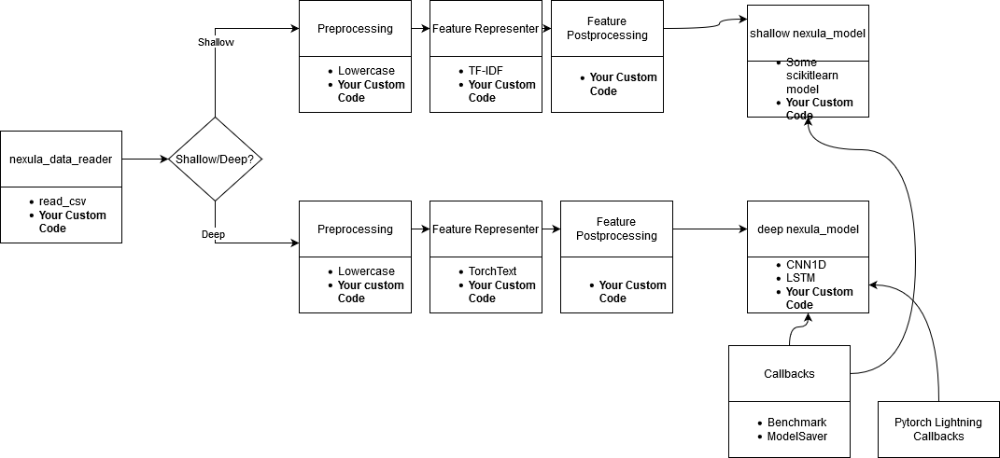

# Nexula (Nexus Lab)
Open Source Benchmark Toolkit (Still in development). Easy, Extendable and Reproducible Toolkit for benchmarking NLP problems.
Currently still has minimum features.

Expect a lot of bugs in the source code :).

# How to install
```
pip install nexula
```
The installation above will not install deep learning packages.
If you want to use Deep Learning, install `pytorch` and `torchtext` manually.

## Overview
This library want to overcome the needs on searching the code of several 
Machine Learning model on separate site on benchmark or testing several models.

Have you ever benchmarked several machine learning models and need to 
go to many websites to collect the code. After that, you need to run 
and configure each of them one by one to benchmark the result. For us, this is really a pain in the neck.  

We want this library make us easier to benchmark and find all famous models that is ready to be benchmarked.
We also want this library EXTENDABLE (can be customized by user) and easier to REPRODUCE. We want to make sure 
the library is easy to use.

For now, this library is far from that dream, but we will achieve it. 

# Quickstart
See `examples` folder. There will be a README.md that should guide you.

# CLI Command
```bash
python -m nexula [Args]
```
Or
```bash
nexula [Args]
```
The args are as follow:
```bash
  -h, --help            show this help message and exit
  -r RUN_YAML, --run-yaml RUN_YAML
                        Yaml file as a command of the nexula
  -v, --verbose         Add verbosity (logging from `info` to `debug`)
  -c CUSTOM_MODULE, --custom-module CUSTOM_MODULE
                        Add custom module directory (your custom code in a code)
```

## Example
Your working directory:
```
sample_run.yaml
custom_nexula/custom_preprocessing.py
```
Run yaml and include your custom code.
```
python -r sample_run.yaml -c custom_nexula
```
# Run as Module/API
To be denounced

# Features

Nexula uses features mostly from:
* scikit-learn
* pytorch-lightning

Nexula only have these choices on how to setup the data:
* dataset input should be separated into train, dev, test

## Pipeline
We separate the pipeline process into 2 steps
* Create dataloader for the input of the model
* Training and predict the model

We separate the model type into two kinds
* Boomer (Shallow Learning) by using scikit-learn
* Millenial (Deep Learning) by using pytorch (wrapped by pytorch-lightning)

## Data Preprocessing
* Lowercase (`nexus_basic_preprocesser`) : Lowercase the input.

## Data Feature Representer Boomer
* TF-IDF (`nexus_tf_idf_representer`) : Use TF-IDF vectorizer on training dataset

## Data Feature Representer TorchText
* TorchText (`nexus_millenial_representer`) : Use TorchText on generating sequence of text in index.

## Boomer Model
All of them are imported from `scikit-learn` packages.
* nexus_boomer_logistic_regression
* nexus_boomer_linear_svc
* nexus_boomer_gaussian_process
* nexus_boomer_random_forest
* nexus_boomer_ada_boost
* nexus_boomer_multinomial_nb
* nexus_boomer_quadratic_discriminant

## Millenial Model
All of them are coded in this repository.
* nexus_millenial_ccn1d_classification
* nexus_millenial_lstm_classification

## Run CLI
* Run yaml as the process controller. Below is the yaml example. See Command Explanation.md in examples 
folder on how to read the yaml.
```yaml
nexula_data:
  data_choice_type: 'manual_split'
  data_reader_type: 'read_csv'
  data_reader_args:
    train:
      file: 'tests/dummy_data/train.csv'
    dev:
      file: 'tests/dummy_data/dev.csv'
    test:
      file: 'tests/dummy_data/test.csv'
  data_pipeline:
    boomer:
      data_representer_func_list_and_args:
        - process: 'nexus_tf_idf_representer'

nexula_train:
  models:
    - model: 'nexus_boomer_logistic_regression'
  callbacks:
    - callback: 'model_saver_callback'
      params:
        output_dir: 'output/integration_test/'
    - callback: 'benchmark_reporter_callback'
      params:
        output_dir: 'output/integration_test/'
```

## Customizable and Extendable
For every step in the pipeline, you can specify your own process.
You must extend the abstract class in `nexula.nexula_inventory.inventory_base`.
```python
from nexula.nexula_inventory.inventory_base import NexusBaseDataInventory
import numpy as np


class AddNewData(NexusBaseDataInventory):

    name = 'add_new_data2'

    def __init__(self, new_data_x='this is a new data', new_data_y=1, **kwargs):
        super().__init__(**kwargs)
        self.new_data_x = new_data_x
        self.new_data_y = new_data_y
        self.model = None

    def get_model(self):
        return self.model

    def __call__(self, x, y, fit_to_data=True, *args, **kwargs):
        """
        Lowercase the text
        Parameters
        ----------
        x
        y
        fit_to_data
        args
        kwargs

        Returns
        -------

        """
        x = np.concatenate(x, [self.new_data_x])
        y = np.concatenate(y, [self.new_data_y])
        return x, y
```
Your preprocessing can be included into yaml (in `nexula_data` part)
```yaml
nexula_data:
  data_choice_type: 'manual_split'
  data_reader_type: 'read_csv'
  data_reader_args:
    train:
      file: 'tests/dummy_data/train.csv'
    dev:
      file: 'tests/dummy_data/dev.csv'
    test:
      file: 'tests/dummy_data/test.csv'
  data_pipeline:
    boomer:
      data_preprocesser_func_list_and_args:
        - process: 'add_new_data2'
          params:
            init:
              new_data_x: 'testing'
              new_data_y: 0
      data_representer_func_list_and_args:
        - process: 'nexus_tf_idf_representer'
```

# Callbacks
* Model Saver (`model_saver_callback`) : Save the model after fitting into the training dataset
* Benchmark Reporter Callback (`benchmark_reporter_callback`) : Output the benchmark result. The benchmark result contains:
    * Metrics choice (currently only supports F1 Score and Accuracy Score)
    * Inference runtime
    * Training runtime
* They are also extendable!

# End
